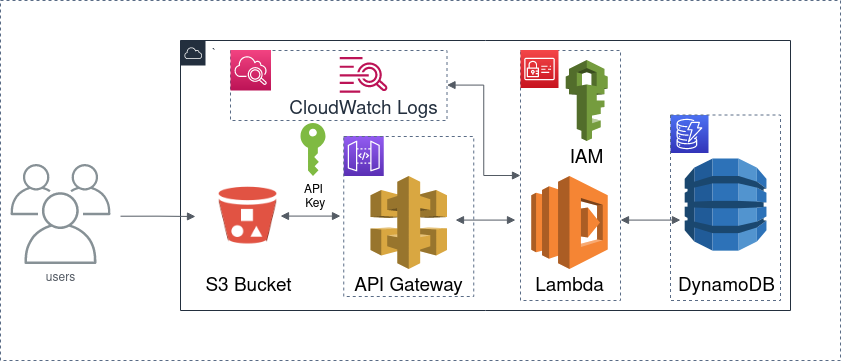

# Serverless Register / Login REST API on AWS

## Requirements

### Backend
- [x] User Registration
- [x] User Login
- [x] User Verification
- [x] Password Encryption (bcrypt)
- [x] User Authorization (JWT)

### Front-End
- [x] User Registration
- [x] User Login
- [x] Responsive User Interface
- [x] API Request Feedback

## Services Used

**AWS Lambda**
- Implement serverless backend
- Manage API key(s)

**AWS Identity Access Management (IAM)**
- Manage administrator *role* for backend

**AWS API Gateway**
- Implement REST API routing

**AWS DynamoDB**
- Database for storing registered users

**AWS CloudWatch**
- Serverless application monitoring and logging

## Architecture

